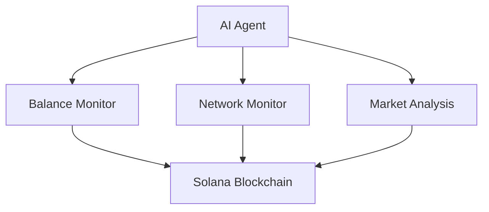

# 🤖 OpenPuter Self-Healing AI Agent

## ✨ Features

- 🔄 **Self-Healing**: Autonomously monitors and maintains its own health
- 💰 **Native SOL Payments**: Pays for its own compute in $SOL
- 🏦 **Wallet Management**: Self-manages funds and balances
- 📊 **Network Monitoring**: Real-time Solana network analysis
- 🛠 **Autonomous Decision Making**: Makes intelligent choices about maintenance and operations
- 🔗 **100% On-Chain**: Fully integrated with Solana blockchain

## 🚀 Quick Start

### Prerequisites

- [Bun](https://bun.sh) installed
- Solana wallet with some SOL
- [Openputer] (https://openputer.com) API key

### Installation

```bash
# Clone the repository
git clone https://github.com/roshanbvadassery/send-openputer-kit

# Install dependencies
cd send-openputer-kit
bun install

# Configure environment
cp .env.example .env
```

### Configuration

Add the following to your `.env` file:

```env
OPENAI_API_KEY=your_openputer_api_key
RPC_URL=your_solana_rpc_url
SOLANA_PRIVATE_KEY=your_wallet_private_key
OPEN_PUTER_WALLET_ADDRESS=wallet_to_monitor
```

### Running the Agent

```bash
bun run index.ts
```

## 🎮 Usage

The agent can run in two modes:

### 1. Autonomous Mode
```bash
# Choose option 2 when prompted
# The agent will:
- Monitor network health
- Manage wallet balances
- Self-heal from errors
- Pay for compute in SOL
```

### 2. Chat Mode
```bash
# Choose option 1 when prompted
# Available commands:
- check balance
- transfer [amount]
- network status
- market analysis
```

## 🛠 Architecture



## 🔧 Tools

- **Balance Monitor**: Tracks and maintains wallet health
- **Network Info**: Real-time Solana network status
- **Token Price**: Current SOL market data
- **TPS Checker**: Network performance metrics

## 📚 Documentation

### Tool Commands

```typescript
// Check balance
await balanceMonitor._call("check")

// Transfer SOL
await balanceMonitor._call("transfer 0.1")

// Check network status
await networkInfo._call()
```

## 🙏 Acknowledgments

- [OpenPuter](https://openputer.com) for the DeepSeek R1 integration
- [Solana Agent Kit](https://github.com/sendaifun/solana-agent-kit) built by SEND to make solana agentic
- [Helius Solana RPC](https://www.helius.dev/) for the blockchain infrastructure
- [LangChain](https://langchain.com) for the agent framework

## 🔗 Links

- [GitHub Repository](https://github.com/roshanbvadassery/send-openputer-kit)
- [Issue Tracker](https://github.com/roshanbvadassery/send-openputer-kit/issues)
- [OpenPuter Documentation](https://openputer.com)

---

<div align="center">
Made with ❤️ by the OpenPuter Community
</div>
